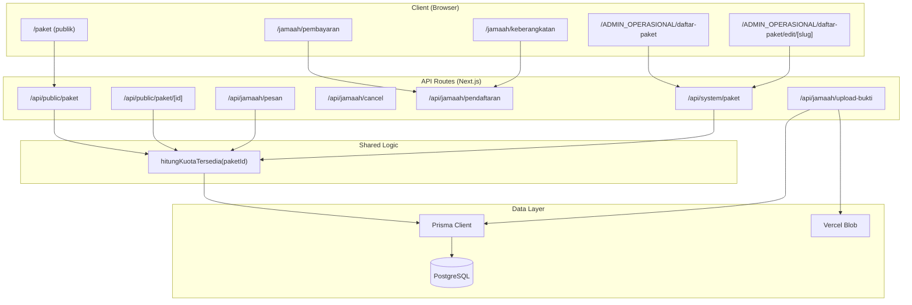

# Design Document: Paket Umrah Terintegrasi

## Overview

Fitur ini mengintegrasikan tiga area fungsional utama dalam sistem manajemen umrah:

1. **Kuota Real-Time** — kalkulasi kuota tersedia yang seragam di semua endpoint, dengan validasi saat pemesanan dan pembatalan.
2. **Manajemen Paket oleh Admin Operasional** — edit data paket termasuk kuota dengan validasi bisnis (kuota baru ≥ pendaftaran aktif).
3. **Detail Pemesanan Jamaah** — halaman pembayaran (DP/cicilan/pelunasan + upload bukti) dan halaman keberangkatan (info lengkap paket, hotel, penerbangan).

Sistem dibangun di atas Next.js 16 App Router, Prisma + PostgreSQL (Prisma Accelerate), NextAuth.js JWT, Vercel Blob untuk file upload, dan Flowbite React + Tailwind CSS untuk UI.

### Masalah yang Diselesaikan

Saat ini terdapat beberapa inkonsistensi:

- `app/api/jamaah/pesan/route.js` melakukan `paket.update({ kuota: { decrement: 1 } })` — ini menyimpan kuota tersedia sebagai field, bertentangan dengan requirement bahwa kuota harus dihitung dinamis dari `COUNT(Pendaftaran)`.
- `app/api/jamaah/cancel/route.js` melakukan `paket.update({ kuota: { increment: 1 } })` — sama, harus dihapus.
- `app/api/system/paket/route.js` PATCH tidak memvalidasi bahwa kuota baru ≥ jumlah pendaftaran aktif.
- Halaman pembayaran jamaah sudah ada tapi tidak menampilkan status `DITOLAK` dengan benar.
- Halaman keberangkatan jamaah sudah ada tapi tidak menampilkan semua field yang dibutuhkan (bandara tujuan, waktu tiba, lokasi hotel).

---

## Architecture



### Prinsip Desain Utama

**Single Source of Truth untuk Kuota**: Kuota tersedia TIDAK disimpan sebagai field terpisah. Selalu dihitung dari `COUNT(Pendaftaran WHERE status IN ['MENUNGGU', 'TERKONFIRMASI'])`. Ini berarti `pesan/route.js` dan `cancel/route.js` harus dihapus logika `decrement`/`increment` pada `Paket.kuota`.

---

## Components and Interfaces

### 1. Shared Utility: `hitungKuotaTersedia`

Fungsi helper yang digunakan oleh semua endpoint untuk menghitung kuota tersedia secara konsisten.

```js
// lib/kuota.js
async function hitungKuotaTersedia(prisma, paketId) {
  const used = await prisma.pendaftaran.count({
    where: {
      paketId,
      status: { in: ["MENUNGGU", "TERKONFIRMASI"] }
    }
  });
  return used; // caller menghitung: paket.kuota - used
}
```

Semua endpoint yang mengembalikan data kuota wajib menggunakan fungsi ini.

### 2. API: `/api/jamaah/pesan` (PATCH)

**Perubahan**: Hapus `prisma.paket.update({ kuota: { decrement: 1 } })`. Validasi kuota menggunakan `hitungKuotaTersedia`.

```
POST /api/jamaah/pesan
Body: { paketId, akunEmail }

Validasi:
  - paket.status === "AKTIF"
  - hitungKuotaTersedia(paketId) < paket.kuota  → jika tidak: 400 "Kuota paket sudah penuh"
  - tidak ada pendaftaran aktif untuk paket+email yang sama
  - jumlah pendaftaran aktif jamaah < 3

Response 201: { message, pendaftaran, kuotaTersedia }
```

### 3. API: `/api/jamaah/cancel` (PATCH)

**Perubahan**: Hapus `prisma.paket.update({ kuota: { increment: 1 } })`. Status berubah ke `TIDAK_TERKONFIRMASI` (bukan `DIBATALKAN` — sesuai schema).

```
POST /api/jamaah/cancel
Body: { pendaftaranId }

Validasi:
  - pendaftaran.status IN ["MENUNGGU", "TERKONFIRMASI"]
  - tidak ada pembayaran berstatus TERVERIFIKASI → jika ada: 400

Response 200: { message, pendaftaran }
```

### 4. API: `/api/system/paket` PATCH

**Perubahan**: Tambah validasi kuota baru ≥ pendaftaran aktif.

```
PATCH /api/system/paket
Body (FormData): { form: JSON({ id, kuota, ...fields }) }

Validasi kuota:
  - kuota harus bilangan bulat positif, ≤ 10.000
  - hitungKuotaTersedia(id) ≤ kuota_baru
    → jika tidak: 400 "Kuota baru tidak boleh lebih kecil dari jumlah pendaftaran aktif (N pendaftaran)"

Response 200: { ...paket, kuotaTersedia }
```

### 5. API: `/api/jamaah/pendaftaran` (sudah ada, minor fix)

Sudah include `paket.hotel` dan `paket.penerbangan`. Tidak ada perubahan struktur, hanya pastikan field `iternary` juga di-include untuk halaman keberangkatan.

### 6. Halaman: `/jamaah/pembayaran`

Sudah ada. Perbaikan yang diperlukan:
- Tambah handling status `DITOLAK` — tampilkan badge merah + pesan penolakan
- Perbaiki kondisi tombol upload: hanya tampil jika `status === "MENUNGGU"` DAN belum ada `buktiUrl`, atau jika `status === "DITOLAK"` (re-upload)
- Validasi tipe file dilakukan di client sebelum submit

### 7. Halaman: `/jamaah/keberangkatan`

Sudah ada. Perbaikan yang diperlukan:
- Tambah tampilan `bandaraTiba` (saat ini tidak ditampilkan)
- Tambah tampilan `waktuTiba` dengan format HH:MM
- Tambah tampilan `lokasi` hotel (MEKKAH/MADINAH)
- Tampilkan "TBA" untuk field yang null/kosong

### 8. Halaman: `/ADMIN_OPERASIONAL/daftar-paket`

Sudah ada. Perbaikan yang diperlukan:
- Kolom `terisi` sudah ada di mapping data, tapi `TableComponent` perlu memastikan kolom ini ditampilkan
- Tambah indikator visual "Penuh" jika `terisi >= kuota`
- `terisi` harus dihitung dari `pendaftaran.filter(p => ['MENUNGGU','TERKONFIRMASI'].includes(p.status)).length`, bukan `pendaftaran.length`

### 9. Halaman: `/ADMIN_OPERASIONAL/daftar-paket/edit/[slug]`

Sudah ada dan menggunakan `PaketForm` yang sudah memiliki field `kuota`. Tidak ada perubahan UI, hanya pastikan API PATCH sudah memvalidasi kuota dengan benar.

---

## Data Models

Model Prisma yang relevan (tidak ada perubahan schema):

```prisma
model Paket {
  id               String      @id @default(cuid())
  nama             String
  kuota            Int                          // Total kapasitas
  status           StatusPaket @default(AKTIF)  // AKTIF | NONAKTIF | DITUTUP
  harga            Int
  tanggalBerangkat DateTime
  tanggalPulang    DateTime
  hotelId          String
  penerbanganId    String
  hotel            Hotel
  penerbangan      Penerbangan
  pendaftaran      Pendaftaran[]
}

model Pendaftaran {
  id        String            @id @default(cuid())
  akunEmail String
  paketId   String
  status    StatusPendaftaran  // MENUNGGU | TERKONFIRMASI | TIDAK_TERKONFIRMASI
  pembayaran Pembayaran[]
}

model Pembayaran {
  id            String           @id @default(cuid())
  pendaftaranId String
  jumlah        Int
  buktiUrl      String?
  status        StatusPembayaran  // MENUNGGU | TERVERIFIKASI | DITOLAK
  // Field 'jenis' (DP/CICILAN_1/PELUNASAN) ada di kode tapi TIDAK ada di schema
}
```

### Catatan Penting: Field `jenis` pada Pembayaran

Kode di `pesan/route.js` menggunakan `jenis: "DP"`, `jenis: "CICILAN_1"`, `jenis: "PELUNASAN"` saat `createMany`, dan halaman pembayaran menggunakan `pembayaran.jenis`. Namun field `jenis` **tidak ada di schema Prisma**. Ini adalah bug yang perlu diaddress:

**Opsi A (Recommended)**: Tambah field `jenis` ke model `Pembayaran` di schema:
```prisma
enum JenisPembayaran {
  DP
  CICILAN_1
  PELUNASAN
}

model Pembayaran {
  // ...
  jenis JenisPembayaran?
}
```

**Opsi B**: Inferensi jenis dari urutan/jumlah (tidak direkomendasikan, rapuh).

Design ini mengasumsikan Opsi A diimplementasikan (migrasi Prisma diperlukan).

### Shape Data API

**Kuota Response (semua endpoint)**:
```json
{
  "kuotaTersedia": 15,
  "isAvailable": true,
  "quotaUsage": { "used": 5, "total": 20, "percentage": 25 }
}
```

**Pendaftaran Response (jamaah)**:
```json
{
  "id": "...",
  "status": "MENUNGGU",
  "paket": {
    "nama": "...", "harga": 25000000,
    "tanggalBerangkat": "...", "tanggalPulang": "...",
    "hotel": { "nama": "...", "lokasi": "MEKKAH", "bintang": 5 },
    "penerbangan": {
      "maskapai": "Garuda Indonesia",
      "bandaraBerangkat": "Raden Intan Lampung",
      "bandaraTiba": "King Abdulaziz",
      "waktuBerangkat": "...", "waktuTiba": "..."
    }
  },
  "pembayaran": [
    { "id": "...", "jenis": "DP", "jumlah": 7500000, "status": "TERVERIFIKASI", "buktiUrl": "..." },
    { "id": "...", "jenis": "CICILAN_1", "jumlah": 7500000, "status": "MENUNGGU", "buktiUrl": null },
    { "id": "...", "jenis": "PELUNASAN", "jumlah": 10000000, "status": "MENUNGGU", "buktiUrl": null }
  ]
}
```

---

## Correctness Properties

*A property is a characteristic or behavior that should hold true across all valid executions of a system — essentially, a formal statement about what the system should do. Properties serve as the bridge between human-readable specifications and machine-verifiable correctness guarantees.*

### Property 1: Kuota Tersedia Tidak Pernah Negatif

*For any* paket dengan kuota N, jumlah pendaftaran aktif (status MENUNGGU atau TERKONFIRMASI) tidak boleh melebihi N. Dengan kata lain, `hitungKuotaTersedia(paketId)` selalu menghasilkan nilai ≥ 0.

**Validates: Requirements 1.1, 1.2, 1.3**

### Property 2: Penolakan Pemesanan saat Kuota Penuh

*For any* paket dengan `kuotaTersedia == 0`, setiap permintaan pemesanan baru harus ditolak dengan HTTP 400 dan pesan "Kuota paket sudah penuh".

**Validates: Requirements 1.2**

### Property 3: Konsistensi Kalkulasi Kuota Lintas Endpoint

*For any* paket, nilai `kuotaTersedia` yang dikembalikan oleh `/api/public/paket`, `/api/public/paket/[id]`, dan `/api/system/paket` harus identik pada saat yang sama, karena semua menggunakan formula yang sama: `paket.kuota - COUNT(Pendaftaran WHERE status IN ['MENUNGGU','TERKONFIRMASI'])`.

**Validates: Requirements 3.1, 3.3, 10.1, 10.3**

### Property 4: Pembatalan Merefleksikan Kuota Tanpa Mutasi Field

*For any* pendaftaran yang dibatalkan (status berubah ke `TIDAK_TERKONFIRMASI`), kalkulasi `kuotaTersedia` pada permintaan berikutnya harus bertambah 1 tanpa ada perubahan pada `Paket.kuota` di database.

**Validates: Requirements 2.1, 2.2**

### Property 5: Validasi Kuota Edit Paket

*For any* permintaan edit paket dengan nilai `kuota_baru < jumlah_pendaftaran_aktif`, API harus menolak dengan HTTP 400 dan menyertakan jumlah pendaftaran aktif dalam pesan error.

**Validates: Requirements 6.4, 6.5**

### Property 6: Upload Bukti Hanya untuk File Gambar ≤ 5MB

*For any* file yang diupload ke `/api/jamaah/upload-bukti`, jika tipe bukan `image/*` atau ukuran > 5MB, maka API harus menolak dengan pesan error yang sesuai dan `Pembayaran.buktiUrl` tidak boleh berubah.

**Validates: Requirements 8.2, 8.3**

### Property 7: Tampilan TBA untuk Data Penerbangan Kosong

*For any* pendaftaran jamaah, jika field `maskapai`, `bandaraTiba`, atau `waktuBerangkat`/`waktuTiba` bernilai null, maka UI harus menampilkan string "TBA" sebagai placeholder.

**Validates: Requirements 9.5**

### Property 8: Ringkasan Keuangan Konsisten

*For any* pendaftaran dengan daftar pembayaran, nilai "sisa yang harus dibayar" harus selalu sama dengan `paket.harga - SUM(pembayaran WHERE status == 'TERVERIFIKASI')`.

**Validates: Requirements 7.3**

---

## Error Handling

### API Error Responses

Semua API mengembalikan JSON dengan format konsisten:
```json
{ "error": "Pesan error yang deskriptif" }
```

| Kondisi | Status | Pesan |
|---|---|---|
| Kuota paket penuh | 400 | "Kuota paket sudah penuh" |
| Kuota edit < pendaftaran aktif | 400 | "Kuota baru tidak boleh lebih kecil dari jumlah pendaftaran aktif (N pendaftaran)" |
| Kuota tidak valid (negatif/> 10000) | 400 | "Kuota tidak valid atau terlalu besar" |
| File bukan gambar | 400 | "File harus berupa gambar" |
| File > 5MB | 400 | "Ukuran file maksimal 5MB" |
| Pembatalan dengan pembayaran terverifikasi | 400 | "Tidak dapat membatalkan pendaftaran yang sudah ada pembayaran terverifikasi" |
| Paket tidak ditemukan | 404 | "Paket tidak ditemukan" |
| Error server | 500 | "Terjadi kesalahan pada server" |

### Client-Side Error Handling

- Validasi file (tipe + ukuran) dilakukan di client sebelum request ke server untuk UX yang lebih cepat
- Alert Flowbite ditampilkan untuk error dan success
- Loading state dengan Spinner selama request berlangsung

---

## Testing Strategy

### Dual Testing Approach

Pengujian menggunakan dua pendekatan komplementer:
- **Unit tests**: Verifikasi contoh spesifik, edge case, dan kondisi error
- **Property tests**: Verifikasi properti universal di berbagai input yang di-generate

### Unit Tests

Fokus pada:
- Contoh spesifik: pemesanan berhasil, pembatalan berhasil, upload bukti berhasil
- Edge case: kuota tepat 1 tersisa, file tepat 5MB, kuota baru tepat sama dengan pendaftaran aktif
- Integrasi: alur lengkap pesan → bayar DP → verifikasi → lihat di halaman pembayaran

### Property-Based Tests

Library: **fast-check** (JavaScript/TypeScript, cocok untuk Next.js)

Konfigurasi: minimum 100 iterasi per property test.

Setiap property test diberi tag komentar:
```
// Feature: paket-umrah-terintegrasi, Property N: <deskripsi singkat>
```

**Property 1 — Kuota Tidak Negatif**:
```
// Feature: paket-umrah-terintegrasi, Property 1: kuota tersedia tidak pernah negatif
// For any paket with quota N and M active registrations (M <= N),
// hitungKuotaTersedia should return N - M (>= 0)
fc.assert(fc.asyncProperty(
  fc.integer({ min: 1, max: 100 }),  // kuota
  fc.integer({ min: 0, max: 100 }),  // pendaftaran aktif
  async (kuota, aktif) => {
    fc.pre(aktif <= kuota);
    // setup: buat paket dengan kuota, buat aktif pendaftaran
    const tersedia = await hitungKuotaTersedia(prisma, paketId);
    return tersedia >= 0 && tersedia === kuota - aktif;
  }
), { numRuns: 100 });
```

**Property 2 — Penolakan saat Kuota Penuh**:
```
// Feature: paket-umrah-terintegrasi, Property 2: penolakan pemesanan saat kuota penuh
// For any paket with kuotaTersedia == 0, POST /api/jamaah/pesan returns 400
```

**Property 3 — Konsistensi Kuota Lintas Endpoint**:
```
// Feature: paket-umrah-terintegrasi, Property 3: konsistensi kalkulasi kuota lintas endpoint
// For any paket, kuotaTersedia from public API == kuotaTersedia from system API
```

**Property 4 — Pembatalan Tanpa Mutasi Kuota**:
```
// Feature: paket-umrah-terintegrasi, Property 4: pembatalan merefleksikan kuota tanpa mutasi field
// For any pendaftaran cancelled, Paket.kuota in DB unchanged, but kuotaTersedia increases by 1
```

**Property 5 — Validasi Edit Kuota**:
```
// Feature: paket-umrah-terintegrasi, Property 5: validasi kuota edit paket
// For any kuota_baru < pendaftaran_aktif, PATCH returns 400
```

**Property 6 — Validasi File Upload**:
```
// Feature: paket-umrah-terintegrasi, Property 6: upload bukti hanya untuk file gambar <= 5MB
// For any non-image file or file > 5MB, POST /api/jamaah/upload-bukti returns 400
```

**Property 7 — TBA untuk Data Kosong**:
```
// Feature: paket-umrah-terintegrasi, Property 7: tampilan TBA untuk data penerbangan kosong
// For any pendaftaran where penerbangan fields are null, rendered output contains "TBA"
```

**Property 8 — Ringkasan Keuangan**:
```
// Feature: paket-umrah-terintegrasi, Property 8: ringkasan keuangan konsisten
// For any list of pembayaran, sisa = harga - sum(terverifikasi) always holds
```
