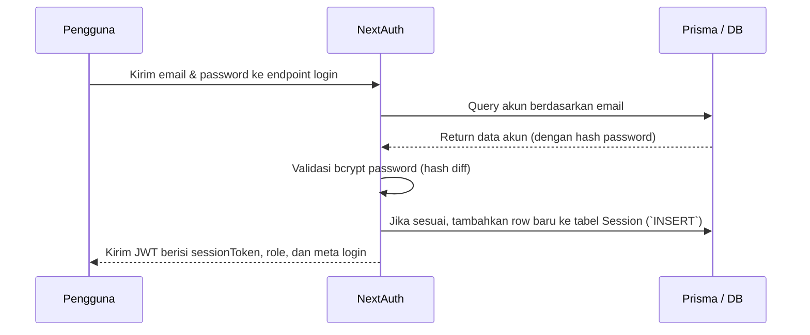
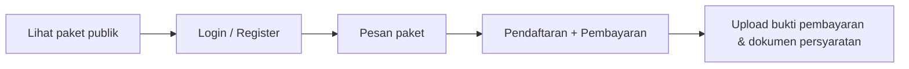
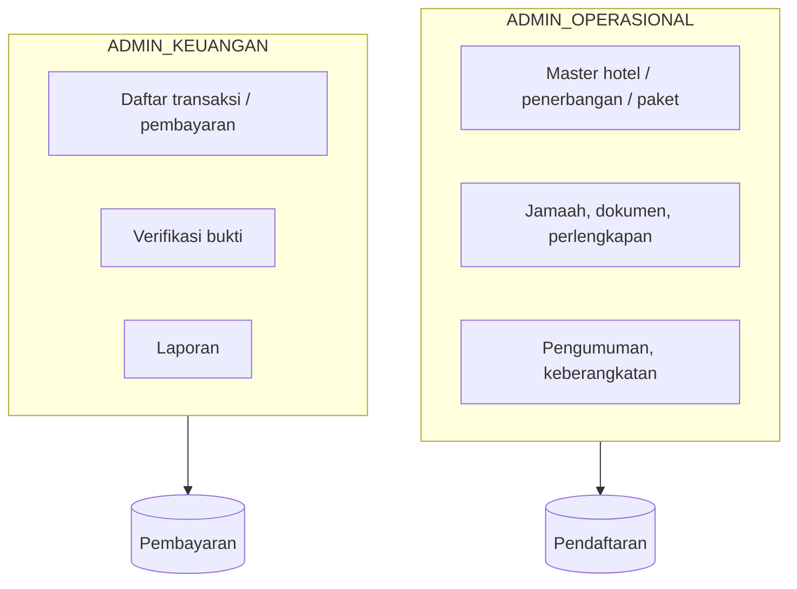

# Ada Tour Travel — Dokumentasi Proyek (Versi Penjelasan Detail)

Aplikasi web **manajemen perjalanan umrah** yang menyediakan kebutuhan digital utama bagi **jamaah** (calon dan pemesan paket), **admin operasional** (mengelola data paket, jamaah, dokumen, pengumuman, dsb), dan **admin keuangan** (mengatur pembayaran, verifikasi, serta laporan transaksi). Arsitektur modern menggunakan **Next.js (App Router)** untuk frontend dan backend dalam satu monorepo, database **PostgreSQL**, serta ORM **Prisma** untuk akses data yang stabil dan type-safe.

---

## Daftar Isi Dokumen

Dokumentasi ini disusun untuk memberikan referensi lengkap dalam pengembangan, penggunaan, dan pemeliharaan proyek. Berikut navigasi utama:

1. [Ringkasan fitur aplikasi](#ringkasan-fitur)
2. [Daftar dan penjelasan teknologi](#teknologi)
3. [Detail peran pengguna & struktur URL](#peran-pengguna--url)
4. [Deskripsi alur bisnis dan autentikasi](#alur-utama-flow)
5. [Diagram & skema relasi database](#skema-database)
6. [Struktur umum folder](#struktur-folder)
7. [Daftar endpoint & API route](#api-routes)
8. [Penjelasan variabel lingkungan](#variabel-lingkungan)
9. [Petunjuk menjalankan lokal/development](#menjalankan-lokal)
10. [Catatan pengembangan & kewaspadaan](#catatan-pengembangan)

**Materi presentasi & panduan kode**

- **`public/presentasi-flow.html`** — presentasi di browser: alur bisnis, middleware, login, jamaah, admin, skema data, API, plus **arsitektur lapisan**, **pola request**, **peta folder → kode**, **bab 11b (daftar menu/fitur → path file `page.jsx` / `route.js`)**, **rantai file** (login/register/API), dan **konvensi coding**.
- **`docs/CODING-GUIDE.md`** — panduan developer: urutan file saat login/register, pola `route.js`, ringkasan endpoint, Prisma, env, checklist deploy.

---

## Ringkasan Fitur

Tabel berikut merangkum fitur utama berdasarkan area aplikasi dan peran pengguna:

| Area                | Fungsi                                                                                                                      |
|---------------------|-----------------------------------------------------------------------------------------------------------------------------|
| **Publik**          | Beranda (landing page), daftar dan detail informasi paket, galeri foto, informasi tentang penyelenggara, testimoni pelanggan |
| **Auth**            | Fitur register jamaah (daftar akun), login via NextAuth (dengan credentials), serta logout                                 |
| **Jamaah**          | Dashboard ringkasan, pengelolaan transaksi/pemesanan paket, proses dan status pembayaran serta upload bukti, kelola dokumen, profil diri, status keberangkatan, dan testimoni                                |
| **Admin operasional** | Manajemen paket perjalanan, master data hotel & penerbangan, kelola data jamaah, pengelolaan dokumen & perlengkapan jamaah, pengumuman jadwal & infomasi, keberangkatan, mitra travel, serta moderasi testimoni |
| **Admin keuangan**  | Melihat daftar transaksi, melakukan verifikasi pembayaran jamaah, serta membuat laporan keuangan atau arus kas              |
| **Lainnya**         | Halaman cetak (`/printing`), fitur upload ke Firebase / Vercel Blob (berdasarkan rute yang aktif)                           |

---

## Teknologi yang Digunakan

- **Framework Utama:** Next.js 16 (Web Apps), React 19 (UI SPA/SSR)
- **Styling / UI:** Tailwind CSS (atomic styling), Flowbite React (komponen interaktif siap pakai)
- **Database:** PostgreSQL (relasional), integrasi penuh dengan **Prisma ORM** (`prisma/schema.prisma`) — Prisma Accelerate (`prisma+postgres://...`) digunakan untuk query cepat & skalabilitas deployment cloud
- **Autentikasi:** NextAuth.js berbasis JWT, dengan status aktif session juga dikunci pada tabel `Session` (di database)
- **Penyimpanan File:** Firebase Admin (cloud storage), Vercel Blob (alternatif upload dengan token khusus)
- **Email:** Nodemailer (SMTP) untuk notifikasi (misal aktivasi, konfirmasi, dsb)
- **Utilitas:** bcrypt (hash password), Chart.js (visualisasi laporan), jsPDF & ExcelJS (download dokumen), SweetAlert2 (notifikasi popup)

---

## Peran Pengguna & Struktur URL

Role (`Role` enum Prisma) secara konsisten dipakai sebagai prefix path frontend dan backend (huruf besar/kecil *harus* sesuai enum Prisma):

| Role (`Role` enum)   | Path utama             | Keterangan                                              |
|----------------------|------------------------|---------------------------------------------------------|
| `jamaah`             | `/jamaah`              | Pengguna (jamaah) setelah registrasi / login            |
| `ADMIN_OPERASIONAL`  | `/ADMIN_OPERASIONAL`   | Admin pengelola paket, data, keberangkatan, dsb         |
| `ADMIN_KEUANGAN`     | `/ADMIN_KEUANGAN`      | Admin khusus bidang pembayaran & keuangan               |

### Middleware & Proteksi

- Prefix `/ADMIN_OPERASIONAL`, `/ADMIN_KEUANGAN`, `/jamaah` **diproteksi** oleh middleware (lihat: `middleware.js`, `middlewares/withAuth.js`)
- Otentikasi via NextAuth menghasilkan JWT berisi **sessionToken** (token unik), dicek Validasi token + role lewat tabel `Session` & field role di tabel `Akun`
- Jika user sudah login ke role tertentu, akses ke `/login` otomatis di-redirect ke path role user. Jika user *berpindah* area role lain, juga di-redirect ke path milik sendiri.

---

## Alur Utama (Flow) — Penjelasan Detail

### 1. Autentikasi (Login & Validasi Sesi)



- **JWT yang diterima user menyimpan sessionToken:**  
  Setiap route yang diproteksi akan membaca token ini, memeriksa apakah baris Session di DB masih valid (belum expired, belum logout), dan mengambil role terbaru pada entity Akun.  
  Jika role di DB berubah di tengah sesi, user otomatis diarahkan ke area baru sesuai role terkini.

### 2. Alur Jamaah: Dari Browsing hingga Pembayaran


- **Penjelasan:**  
  - User publik mulai dengan melihat daftar paket perjalanan umrah secara terbuka.  
  - Untuk memesan, pengguna harus register/login terlebih dahulu.
  - Setelah login, user bisa memesan (Pesan paket) dan akan memperoleh entri **pendaftaran**.
  - Pada tahap pendaftaran, jamaah diharuskan melakukan pembayaran (ada sistem DP, cicilan, pelunasan sesuai progres).
  - Bukti pembayaran dan dokumen penting (misal paspor, KTP, sertifikat vaksin, dsb) di-upload via dashboard jamaah.

- **Hubungan data:**  
  Entity utama adalah **Paket**, lalu **Pendaftaran** (link jamaah-paket), dan anak entity lain: **Pembayaran**, **Dokumen**, **Perlengkapan** (atribut barang/jadwal), **Pengumuman** (khusus pendaftaran), **Iternary** (rencana perjalanan, jika ada).

### 3. Alur Admin Operasional dan Keuangan


- **Penjelasan**:  
  - Admin operasional bertanggung jawab penuh pada data master (paket, hotel, penerbangan), pengelolaan semua jamaah & kelengkapannya, hingga update pengumuman/keberangkatan.
  - Admin keuangan hanya membuka audit trail pembayaran, memverifikasi bukti transfer dari jamaah, serta menjalankan pelaporan keuangan secara periodik.

---

## Skema Database — Diagram & Penjelasan Relasi

- **`prisma/schema.prisma`** adalah acuan utama. Diagram berikut meringkas entity utama dan relasinya:

```mermaid
erDiagram
  Akun ||--o{ Session : "sessions"           -- Setiap user bisa punya >=1 sesi aktif (JWT)
  Akun ||--o| ProfilAkun : "profil"          -- Data tambahan profil user tiap akun (extended info)
  Akun ||--o{ Pendaftaran : "pendaftaran"    -- Satu akun bisa ada banyak pendaftaran untuk paket berbeda
  Akun ||--o{ Testimoni : "testimoni"        -- Jamaah dapat memberi >1 testimoni

  Paket }o--|| Hotel : "hotel"               -- Paket memiliki master referensi hotel
  Paket }o--|| Penerbangan : "penerbangan"   -- Paket terkait penerbangan tertentu
  Paket ||--o{ Pendaftaran : "pendaftaran"   -- Setiap pendaftaran link ke satu paket

  Pendaftaran ||--o{ Pembayaran : "pembayaran"
  Pendaftaran ||--o{ Dokumen : "dokumen"
  Pendaftaran ||--o{ Perlengkapan : "perlengkapan"
  Pendaftaran ||--o{ Iternary : "iternary"
  Pendaftaran ||--o{ Pengumuman : "pengumuman"
```

### Penjelasan Enum & Status Penting

- **`Role`:** Hak akses utama, dapat bernilai `jamaah`, `ADMIN_KEUANGAN`, `ADMIN_OPERASIONAL`
- **`StatusPaket`:** Status administrasi paket (`AKTIF`: dapat dipesan, `NONAKTIF`: tersembunyi, `DITUTUP`: sudah lewat/perjalanan selesai)
- **`StatusPendaftaran`:** Progress pendaftaran jamaah (`MENUNGGU` konfirmasi admin, `TERKONFIRMASI` sudah valid, `TIDAK_TERKONFIRMASI` ditolak/cancel)
- **`StatusPembayaran`:** Status pembayaran jamaah (`MENUNGGU`, `TERVERIFIKASI`, atau `DITOLAK`)
- **`JenisPembayaran`:** Tipe pembayaran untuk satu pendaftaran (DP, CICILAN_1, PELUNASAN)
- **`JenisDokumen`:** Dokumen wajib (seperti PASPOR, KTP, FOTO, VAKSIN, VISA)
- **`StatusDokumen`:** Proses verifikasi dokumen (`MENUNGGU`, `DISETUJUI`, `DITOLAK`)
- **`JenisPerlengkapan`:** Barang yang diberikan selama proses (`KOPER`, `BAJU_IHRAM`, `MUKENA`, dll.)
- **`Lokasi` (hotel):** Area menginap utama (`MEKKAH`, `MADINAH`)

---

## Struktur Folder (Monorepo)

Struktur layaknya standar Next.js (App Router):

```
app/
  (public)/              # Halaman publik bebas akses (home, daftar paket, dsb)
  (auth page)/           # Halaman login & register
  jamaah/                # Area private khusus jamaah
  ADMIN_OPERASIONAL/     # Dashboard/panel admin operasional
  ADMIN_KEUANGAN/        # Dashboard admin keuangan
  api/                   # Handler route API (REST-like)
  printing/              # Halaman untuk fitur cetak
components/              # Komponen UI reusable (form, table, dsb)
lib/                     # Fungsionalitas umum (prisma client, firebase, mailer, helpers upload, dsb)
middlewares/             # Fitur proteksi/middleware (contoh: withAuth.js)
prisma/
  schema.prisma          # Definisi schema database Prisma
  migrations/            # Folder riwayat migrasi Prisma
public/                  # Asset statis (logo, gambar, dll)
file-data.js             # Seed admin (import dari file json)
file-data.json           # Data raw email/pw awal admin (hanya waktu dev)
```

---

## API Routes (REST dan Handler)

Tabel berikut merangkum endpoint publik & privat, serta fungsi utamanya. Silakan cek implementasi pada masing-masing `route.js`.

| Prefix                                       | Fungsi                                                      |
|-----------------------------------------------|-------------------------------------------------------------|
| `/api/auth/[...nextauth]`                    | Handler NextAuth - login/logout/auth session                |
| `/api/public/paket`                          | Fetch daftar paket untuk landing/public                     |
| `/api/system/register`                       | Handler registrasi akun jamaah                              |
| `/api/system/paket`, `hotel`, `penerbangan`  | Master data (admin operasional)                             |
| `/api/system/order`, `registration`, `pembayaran` | Order paket, pendaftaran, dan pembayaran (jamaah/admin)  |
| `/api/system/document`, `perlengkapan`, `pengumuman`, `akun`, `mitra`, `delete`, `logout` | Aksi manajemen data operasional/admin                    |
| `/api/jamaah/pesan`, `pendaftaran`, `cancel`, `upload-*`, `testimoni` | Fitur transaksi jamaah (pemesan/riwayat/upload/testimoni)|

---

## Variabel Lingkungan (.env)

**Langkah awal:** Salin `.env.example` ke `.env` lalu isikan masing-masing variabel sesuai environment (JANGAN publikasikan nilai sensitif!).

| Variabel                | Kegunaan                                   |
|-------------------------|--------------------------------------------|
| `DATABASE_URL`          | Koneksi PostgreSQL / Prisma Accelerate     |
| `NEXTAUTH_URL`          | URL utama aplikasi, contoh `http://localhost:3000` |
| `NEXTAUTH_SECRET`       | Secret acak untuk enkripsi JWT NextAuth    |

**Optional/opsional:**  
| Variabel                  | Kegunaan                                   |
|---------------------------|--------------------------------------------|
| `SMTP_USER`, `SMTP_PASS`  | Data login email server (Nodemailer SMTP)  |
| `FIREBASE_*`              | Konfigurasi Firebase Admin/storage         |
| `BLOB_READ_WRITE_TOKEN`   | Token upload Vercel Blob                   |
| `NEXT_PUBLIC_BASE_URL`    | Base URL publik aplikasi (untuk fetch API client, dll) |

---

## Menjalankan Aplikasi Secara Lokal (Development)

Langkah cepat menjalankan aplikasi:

```bash
npm install                             # Install seluruh depedensi
npx prisma generate                     # Generate prisma client dari schema
# Edit DATABASE_URL di .env - jalankan migrasi sesuai kebutuhan:
npx prisma migrate deploy / migrate dev # (pilih sesuai alur)
npm run dev                             # Start Next.js lokal
```

- Akses aplikasi melalui [http://localhost:3000](http://localhost:3000).
- Untuk mengisi seed data awal admin (2 user: keuangan & operasional):

```bash
npm run seed:file-data
```

**PERINGATAN:**  
file **file-data.json** hanya untuk development/testing, menyimpan email dan password default plaintext. **Jangan pernah commit password produksi ke repo GitHub publik.**

---

## Catatan Pengembangan & Tips

1. **Seed data:** Script `prisma/seed.js` saat ini belum 100% sinkron dengan schema model terbaru. Hindari pakai `npm run seed` default — gunakan `npm run seed:file-data` saja.
2. **Optimasi Prisma Accelerate:** Pada `lib/prisma.js`, jika env `DATABASE_URL` menggunakan prefix `prisma+`, maka client otomatis memakai extension `@prisma/extension-accelerate` untuk performa baca-tulis cloud.
3. **Middlewares:** `middlewares/withAuth.js` memuat `"use server"` di baris pertama — ini kurang lazim untuk middleware modern. Jika terjadi error di edge/SSR runtime, coba hapus atau migrasikan logic ke lain tempat.
4. **Keamanan:** Jangan commit file-file kredensial `.env`, `env.download`, `file-data.json` dengan data sensitif ke repo publik.
5. **Visualisasi Diagram:** Diagram Mermaid di README dapat di-preview dengan plugin editor atau di GitHub yang sudah mendukung Mermaid.

---

## Lisensi, Branding, dan Catatan Lain

Nama aplikasi pada UI: **Ada Tour Travel**.  
Jika ke depan ada perubahan domain, lisensi, atau entitas hukum — mohon sesuaikan seluruh branding & informasi di README ini sebelum deployment/produksi.

---
